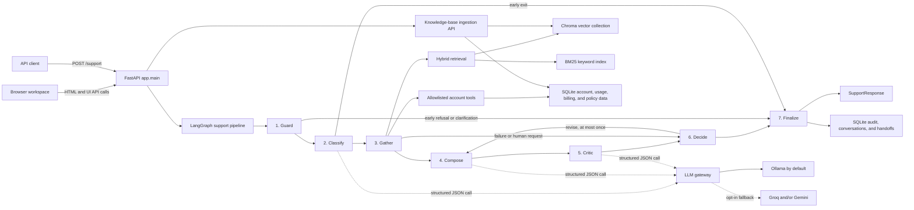

# InsightDesk

InsightDesk is a demonstration customer-support system for a fictional SaaS analytics product. It combines a FastAPI service and browser-based workspace with a LangGraph support pipeline, a searchable knowledge base, customer/account data, and policy-driven escalation.

The primary frontend is served by FastAPI at `/` and `/ui`. A separate Streamlit service is not required to use the main application.

## Contents

- [Capabilities](#capabilities)
- [Architecture](#architecture)
- [Support request lifecycle](#support-request-lifecycle)
- [Application design](#application-design)
- [Repository layout](#repository-layout)
- [Requirements](#requirements)
- [Run locally](#run-locally)
- [Configuration](#configuration)
- [Use the web workspace](#use-the-web-workspace)
- [Screenshots](#screenshots)
- [HTTP API](#http-api)
- [Data and knowledge-base operations](#data-and-knowledge-base-operations)
- [Testing](#testing)
- [Docker](#docker)
- [Security and deployment notes](#security-and-deployment-notes)
- [Known limitations](#known-limitations)

## Capabilities

- Answers product questions from version- and date-aware knowledge-base content.
- Retrieves account, plan, usage, invoice, refund eligibility, and platform status through an allowlisted set of tools.
- Distinguishes prospects, new customers, existing customers, and former customers.
- Escalates sensitive or unresolved requests through deterministic policy decisions and creates a handoff bundle.
- Preserves short, PII-redacted conversation history and prevents a conversation from being reused across accounts.
- Ingests Markdown, text, and JSON ticket files into the knowledge base.
- Provides workspace sections for support chat, ingestion, retrieval, audits and handoffs, database inspection, and system health.
- Records trace IDs, source citations, tool results, policy decisions, latency, and guardrail events for auditability.

## Architecture



The application has four main layers:

1. **HTTP and browser layer.** `app/main.py` serves the FastAPI routes and the embedded single-page browser UI. `app/ingest_api.py` adds the knowledge-base upload and source-management routes.
2. **Orchestration layer.** `app/graph.py` builds and runs the seven-node LangGraph pipeline. The graph carries validated request data, conversation context, retrieved evidence, tool results, policy decisions, and audit metadata.
3. **Decision and safety layer.** Input, processing, and output guardrails sanitize data and constrain behavior. `app/escalation.py` and `app/policy.py` make the final answer/revise/escalate/not-found decision in code rather than asking an LLM to decide.
4. **Persistence and model layer.** SQLite stores account and operational data, policies, conversations, audits, and handoffs. ChromaDB stores embedded knowledge-base chunks. BM25 provides keyword retrieval. The LLM gateway uses Ollama first and permits cloud providers only when explicitly configured.

## Support request lifecycle

1. **Receive and identify.** `POST /support` validates the request. The account context comes from the `X-Account-ID` header, never from instructions in customer text. The service assigns trace and conversation IDs and determines the customer segment.
2. **Load bounded memory.** Up to six earlier turns are made available, with each turn limited to 300 characters. Conversation content is redacted before storage and redacted again when loaded. A conversation tied to a different account is refused.
3. **Guard input.** The input guard checks empty and oversized messages, redacts PII and secrets, detects prompt-injection attempts and abusive language, and can refuse unsupported or unsafe requests early.
4. **Classify.** The model returns a Pydantic-validated JSON classification, including intent, urgency, sentiment, product version, clarification needs, possible tool needs, and escalation topics. The classifier does not choose the final escalation outcome.
5. **Gather evidence.** The system searches the knowledge base and runs only the allowlisted tools permitted for the account. Retrieved chunks and tool plans are checked by processing guardrails. Prospects do not receive account-specific tool access.
6. **Compose and critique.** For requests that can proceed, the composer drafts a response based on the gathered evidence. The critic evaluates groundedness, coverage, PII risk, and policy risk. A revision can be attempted at most once.
7. **Decide in code.** The policy engine applies configured, effective-dated thresholds and rules. Failures, escalation topics, explicit human requests, repeated contact, unresolved source conflicts, knowledge gaps, and critic results are evaluated in policy order.
8. **Finalize and record.** The finalizer constructs the customer response from the approved draft or fixed templates, validates output, creates a handoff when needed, and writes redacted conversation and audit records.

The graph has early exits for refusals, clarifications, and out-of-scope requests. Failed or ambiguous processing fails closed toward escalation or a safe not-found response rather than inventing an answer.

## Application design

### LangGraph nodes

| Node | Responsibility | Model call |
|---|---|---|
| `guard` | Redact and check the incoming message; apply early refusals where needed. | No |
| `classify` | Determine intent and request attributes; identify possible tools and escalation signals. | Yes |
| `gather` | Search and sanitize knowledge-base evidence, resolve source precedence, and run permitted tools. | No |
| `compose` | Draft an evidence-grounded customer response with citations. | Yes |
| `critic` | Assess groundedness, completeness, PII risk, and policy risk. | Yes |
| `decide` | Apply deterministic policy to answer, revise, escalate, or mark not found. | No |
| `finalize` | Apply output checks, construct the response/handoff, and write audit and conversation data. | No |

The only runtime model calls are in `classify`, `compose`, and `critic`, through `app/llm.py`. Prompts are loaded from `prompts/`. Customer text, history, sources, and tool results are passed as data, not as system instructions.

### Retrieval design

`app/retrieval.py` combines dense vector search and BM25 keyword search using reciprocal-rank fusion. It then applies product-version and effective-date filters, reranks candidates with a cross-encoder when enabled, limits repeated chunks from a single source, and returns citation metadata. Future-effective sources are reported separately; deprecated or otherwise excluded sources are not silently treated as current evidence.

Source precedence is resolved separately from retrieval. This lets the system retrieve relevant but contradictory sources, then explicitly decide which source governs or whether the conflict remains unresolved.

### Data stores

| Store | Data |
|---|---|
| SQLite (`data/insightdesk.db`) | Accounts, plan limits, usage, invoices, platform status, policy registry, source register, ingestion state, conversations, audit logs, and handoffs. |
| ChromaDB (`data/chroma/`) | Knowledge-base chunk text, embeddings, and retrieval metadata in the `kb_chunks` collection. |
| In-memory BM25 index | Keyword-search index derived from registered knowledge-base chunks; refreshed so newly ingested content can be searched. |

The local SQLite database and Chroma directory are generated by seeding and are ignored by Git. Rebuildable source data and generation scripts live under `data/` and `scripts/`.

### Guardrail design

Guardrails are applied at three trust boundaries:

- **Input:** PII and secret redaction, secret-request handling, prompt-injection detection, delimiter neutralization, abusive-language handling, and account-boundary checks.
- **Processing:** Retrieved chunks are sanitized, tool calls are allowlisted and account-scoped, and untrusted text is wrapped or escaped before being placed in prompts.
- **Output:** Drafts, responses, handoff bundles, and audit state are checked and sanitized before returning or storing them.

Guardrails may refuse, redact, remove unsafe content, revise, or escalate. They must not make a decision less strict. Guardrail events are recorded for audit without copying raw PII into event details.

### Customer segments and tools

Customer segmentation is determined in code:

- `prospect`: no account ID was provided.
- `new_customer`: account creation falls within the configured new-customer window (30 days by default).
- `existing_customer`: active account outside the new-customer window.
- `former_customer`: cancelled account.

The allowlisted tools are `lookup_account`, `get_usage`, `get_plan_limits`, `get_invoices`, `check_refund_eligibility`, `check_platform_status`, and `send_password_reset`. They do not accept an account ID sourced from the customer message. Password-reset requests initiate a secure flow; reset links and credentials are not returned in chat.

### Policy-based decisions

`app/nodes/decide.py` loads applicable policy thresholds for the request's as-of date and account plan. `app/escalation.py` evaluates the decision deterministically. Policy parameters can include critic groundedness, revision count, repeated-contact threshold, negative sentiments, and escalation topics. A missing registry value falls back to a documented default. The applied rule IDs and escalation reasons are available in the response/audit data as appropriate.

## Repository layout

```text
app/
  main.py                 FastAPI routes and embedded browser UI
  graph.py                LangGraph construction, routing, and request lifecycle
  schemas.py              Pydantic request, response, tool, and graph-state contracts
  llm.py                  Structured-output model gateway
  db.py                   SQLite schema, connections, and reference data
  audit.py                Conversation and audit persistence
  retrieval.py            Hybrid search, filters, reranking, and result assembly
  embeddings.py           Embedding and reranking model setup
  store.py                Chroma collection and BM25 index
  ingest.py               Knowledge-base ingestion and atomic upsert
  ingest_api.py           Upload and source-management routes
  tools.py                Read-only account tools and handoff creation
  policy.py               Effective-dated policy loading
  escalation.py           Deterministic decision rules
  precedence.py           Knowledge-source precedence resolution
  segment.py              Customer-segment calculation
  guardrails/             Input, processing, output, and log protections
  nodes/                  Seven LangGraph node implementations
prompts/                  Classifier, composer, critic, and KB-generation prompts
data/
  kb/articles/             Markdown knowledge-base articles
  kb/tickets/              JSON support tickets used as retrieval data
  seed/                    Account and operational seed CSVs
scripts/                   Seeding, generation, validation, and evaluation commands
tests/                     API, pipeline, tools, retrieval, and guardrail tests
ui/                        Additional UI implementation used by the Compose Streamlit service
docs/data_pipeline.md      Ingestion, retrieval, and data-generation details
```

## Requirements

- Python 3.11 or newer. The Docker image uses Python 3.11.
- A virtual environment is recommended.
- An Ollama server and the configured model for live, local model inference. The default model is `qwen2.5:7b-instruct`.
- Network access on the first run to download the default embedding and reranking models. The default embedding model is `BAAI/bge-small-en-v1.5`; reranking uses `cross-encoder/ms-marco-MiniLM-L-6-v2` when enabled.

The automated tests can run without a model server by setting `MOCK_LLM=true`. Depending on the test and embedding configuration, model assets may still be downloaded unless the test setup uses the hash embedder.

## Run locally

The following commands use PowerShell on Windows.

### 1. Create and activate an environment

```powershell
py -3.11 -m venv .venv
.\.venv\Scripts\Activate.ps1
python -m pip install --upgrade pip
python -m pip install -r requirements.txt
```

If PowerShell script activation is disabled, call the virtual-environment executables directly:

```powershell
.\.venv\Scripts\python.exe -m pip install -r requirements.txt
```

### 2. Configure the application

```powershell
Copy-Item .env.example .env
```

The defaults use a local Ollama instance at `http://localhost:11434`. Start Ollama and make sure the configured model is available:

```powershell
ollama pull qwen2.5:7b-instruct
```

For a no-model smoke test, set `MOCK_LLM=true` in `.env`. Mock mode is intended for tests and development, not for evaluating answer quality.

### 3. Build the local data stores

```powershell
python scripts/seed.py
```

Seeding creates or updates the SQLite database, loads account/reference data, and ingests the Markdown articles and JSON tickets into ChromaDB. On first run, ingestion can take time while the embedding model is downloaded and documents are indexed.

To delete and rebuild the local stores:

```powershell
python scripts/seed.py --reset
```

`--reset` deletes the generated local SQLite database and Chroma directory before rebuilding them. Do not use it if you need to retain local data.

### 4. Start FastAPI and the browser UI

```powershell
python -m uvicorn app.main:app --host 0.0.0.0 --port 8000 --reload
```

Open:

- Browser workspace: <http://localhost:8000/>
- Alternate UI path: <http://localhost:8000/ui>
- OpenAPI/Swagger: <http://localhost:8000/docs>
- ReDoc: <http://localhost:8000/redoc>
- Health check: <http://localhost:8000/health>

The interactive workspace is HTML and JavaScript served by the FastAPI app itself. No separate frontend development server is needed.

### macOS or Linux

```bash
python3 -m venv .venv
source .venv/bin/activate
python -m pip install --upgrade pip
python -m pip install -r requirements.txt
cp .env.example .env
python scripts/seed.py
python -m uvicorn app.main:app --host 0.0.0.0 --port 8000 --reload
```

## Configuration

Settings are loaded from environment variables and, when present, the repository-root `.env` file. Environment variables take precedence over `.env`.

| Variable | Default | Purpose |
|---|---|---|
| `MOCK_LLM` | `false` | Return deterministic mock model outputs for tests and local development. |
| `LLM_PROVIDER` | `ollama` | Documented default provider; the gateway uses Ollama first. |
| `LLM_FALLBACK` | `cloud` in `.env.example`; otherwise `none` | Set to `cloud` to permit configured Groq and Gemini fallbacks after Ollama. |
| `OLLAMA_HOST` | `http://localhost:11434` | Ollama server base URL. |
| `OLLAMA_MODEL` | `qwen2.5:7b-instruct` | Local runtime model. |
| `GROQ_API_KEY` | unset | Optional secret for Groq fallback. |
| `GROQ_MODEL` | `qwen/qwen3.8-27b` | Groq model name. |
| `GEMINI_API_KEY` | unset | Optional secret for Gemini fallback. |
| `GEMINI_MODEL` | `gemini-3.5-flash` | Gemini model name. |
| `LLM_TIMEOUT` | `60` seconds | Timeout for a provider request. |
| `LLM_MAX_RETRIES` | `2` | Retries for invalid structured output. |
| `EMBED_MODEL` | `BAAI/bge-small-en-v1.5` | Dense embedding model. |
| `RERANK` | `true` | Enable or disable cross-encoder reranking. |
| `RERANK_MODEL` | `cross-encoder/ms-marco-MiniLM-L-6-v2` | Cross-encoder reranking model. |
| `EMBEDDER` | Default embedding implementation | Set to `hash` to use the lightweight deterministic test embedder. |
| `DB_PATH` | `data/insightdesk.db` | Optional SQLite database file path. |
| `CHROMA_DIR` | `data/chroma` | Optional ChromaDB persistence directory. |

Ollama remains first in the provider chain. Cloud inference is opt-in through `LLM_FALLBACK=cloud` and is only available for providers whose API keys are configured. Keep API keys in local environment configuration; do not commit secrets to `.env` or source control.

## Use the web workspace

The FastAPI-served workspace has the following sections:

- **Support Chat:** Choose an account context and date, send support messages, and inspect citations, answer type, intent, segment, trace ID, and handoff details.
- **Knowledge Base and Ingestion:** Upload supported files, optionally provide source metadata, run a dry-run preview, and inspect or refresh registered sources.
- **Retrieval and Precedence:** Search the indexed knowledge base with version/date filters and inspect retrieved chunks and conflicts.
- **Audit and Handoffs:** Look up an audit record by trace ID or a handoff by handoff ID.
- **Database Explorer:** Inspect SQLite tables and ChromaDB chunks.
- **System Health:** Review application/database/vector-store statistics and seed controls.

The login dialog is a client-side demo convenience. It is not server-side authentication and must not be treated as an access-control boundary.

## Screenshots

The screenshots below show the FastAPI-served browser workspace and its main sections.

<details>
<summary>Sign-in screen</summary>


</details>

<details>
<summary>Support chat and prompt-injection handling</summary>


</details>

<details>
<summary>Knowledge-base ingestion</summary>


</details>

<details>
<summary>Retrieval and precedence explorer</summary>


</details>

<details>
<summary>Audit and handoffs</summary>


</details>

<details>
<summary>Database explorer</summary>


</details>

<details>
<summary>System health</summary>


</details>

<details>
<summary>Architecture and data-store documentation</summary>


</details>

## HTTP API

FastAPI's interactive schema is available at `/docs`. The main routes are:

| Method | Path | Purpose |
|---|---|---|
| `GET` | `/health` | Returns application health and the active embedder name. |
| `POST` | `/support` | Runs one request through the support pipeline. |
| `GET` | `/conversations/{conversation_id}` | Returns redacted conversation turns. |
| `GET` | `/handoffs/{handoff_id}` | Returns a handoff record and its bundle. |
| `GET` | `/audit/{trace_id}` | Looks up an audit record by trace ID. |
| `GET` | `/api/search` | Runs retrieval and precedence inspection for a query. |
| `GET` | `/api/stats` | Returns SQLite table counts, Chroma chunk count, and embedder. |
| `GET` | `/api/db/tables` | Lists database table names, columns, and row counts. |
| `GET` | `/api/db/table/{table_name}` | Reads a bounded page of rows from a table. |
| `GET` | `/api/db/chroma` | Reads a bounded page of Chroma chunks and metadata. |
| `POST` | `/ingest` | Uploads and indexes Markdown, text, or JSON ticket content. |
| `GET` | `/sources` | Lists registered knowledge-base sources. |
| `GET` | `/sources/{source_id}` | Gets a source-register entry. |
| `DELETE` | `/sources/{source_id}` | Deletes a registered source and its indexed content. |
| `POST` | `/admin/seed` | Seeds database and knowledge-base data from the API. |
| `GET` | `/`, `/ui` | Serves the browser workspace. |

### Support request example

The account ID is optional. Omitting it represents a prospect; account-specific questions may then require sign-in. For an existing account, pass its ID in the `X-Account-ID` header.

```http
POST /support HTTP/1.1
Host: localhost:8000
Content-Type: application/json
X-Account-ID: A1001

{
  "message": "Why did my workflow fail with CF-503?",
  "conversation_id": "C-demo-001",
  "product_version": "4.3",
  "as_of_date": "2026-10-06"
}
```

Example with `curl`:

```bash
curl -X POST http://localhost:8000/support \
  -H "Content-Type: application/json" \
  -H "X-Account-ID: A1001" \
  -d '{"message":"Why did my workflow fail with CF-503?","conversation_id":"C-demo-001","product_version":"4.3","as_of_date":"2026-10-06"}'
```

The response includes a trace ID, conversation ID, answer type, answer text, intent/classification, citations, tools invoked, optional critic information, detected conflicts, optional handoff ID, as-of date, and customer segment.

### Ingestion example

```bash
curl -X POST http://localhost:8000/ingest \
  -F "file=@KB-NEW-001.md" \
  -F 'metadata={"source_id":"KB-NEW-001","doc_type":"article","title":"New article","authority_level":1,"product_versions":"4.x","last_updated":"2026-10-06"}'
```

Validate and preview without writing:

```bash
curl -X POST "http://localhost:8000/ingest?dry_run=true" \
  -F "file=@KB-NEW-001.md"
```

Uploads are limited to 2 MB and supported extensions are `.md`, `.markdown`, `.txt`, and `.json`. See [docs/data_pipeline.md](docs/data_pipeline.md) for metadata, chunking, sanitization, storage, retrieval, generation, and validation details.

## Data and knowledge-base operations

The knowledge-base content and synthetic world are defined from project data and generated files. `app/world.py` contains the world specification; `scripts/` provides generation, validation, loading, seeding, and retrieval evaluation commands.

| Command | Purpose |
|---|---|
| `python scripts/seed.py` | Initialize SQLite, load seed CSVs, and ingest all article and ticket files. |
| `python scripts/seed.py --reset` | Delete generated local stores and rebuild them. |
| `python scripts/validate_accounts.py --dir data/seed` | Validate seed account data. |
| `python scripts/validate_kb.py` | Validate generated knowledge-base documents. |
| `python scripts/retrieval_eval.py` | Evaluate retrieval hit rate, MRR, and latency. |
| `python scripts/load_accounts.py --dir test_accounts/` | Load a supplied account dataset after validation. |

The ingestion pipeline validates metadata, parses and sanitizes content, redacts PII, flags suspicious instruction-like text, chunks articles by section and tickets by record, embeds the chunks, then updates the vector store and source register. Ingestion is idempotent for unchanged content. Embeddings are prepared before replacing indexed data so an embedding failure does not leave a source partially updated.

The account tools operate over synthetic demonstration data. The seed set includes edge cases for plan quotas, billing, refund windows, suspended or cancelled accounts, and product versions. Do not use these fixtures as real customer records.

## Testing

Run the test suite without a live model:

```powershell
$env:MOCK_LLM = "true"
python -m pytest -q
```

Or on macOS/Linux:

```bash
MOCK_LLM=true python -m pytest -q
```

Tests cover the API, graph and memory behavior, LLM parsing, guardrails, account tools, policy decisions, precedence, ingestion/retrieval, and PII handling. See `tests/` for the individual test modules. The project-specific guardrail rules and red-team cases are documented in [GUARDRAILS.md](GUARDRAILS.md) and `tests/redteam_cases.jsonl`.

## Docker

The Compose configuration builds the API and an additional Streamlit service. The primary FastAPI browser workspace remains available on port 8000; the Streamlit service is a separate optional interface on port 8501.

1. Create `.env` from `.env.example` and configure the desired model provider.
2. Ensure Ollama is running on the host if using local model inference.
3. Build and start the services:

```bash
docker compose up --build
```

Then open <http://localhost:8000/> for the FastAPI-served workspace or <http://localhost:8501/> for the separate Compose Streamlit interface. The Compose configuration mounts `./data` into the API container and directs containerized Ollama requests to `host.docker.internal`.

The compose file does not automatically run the seed script. Seed the data before starting the app, or seed through `POST /admin/seed` after startup. The API seed endpoint's `reset=true` option deletes generated local stores; use it carefully.

## Security and deployment notes

InsightDesk is a hackathon/demo application, not a production-ready multi-tenant service:

- The browser sign-in is implemented in client-side JavaScript and is not real authentication.
- The API currently enables permissive CORS for development.
- Several inspection, ingestion, deletion, and administrative endpoints do not implement production authorization.
- The project uses synthetic account, billing, and support data.
- The default Ollama URL is local; cloud providers are contacted only when cloud fallback is enabled and credentials are configured.

Do not expose this service to an untrusted network or use it to process real customer data without implementing server-side authentication and authorization, restrictive CORS, deployment secrets management, request controls, and an appropriate data-retention policy.

For team ownership and contract details, see [TEAM.md](TEAM.md) and [CLAUDE.md](CLAUDE.md).

## Known limitations

- Answer quality and latency depend on the configured model, prompt, available evidence, and local hardware/provider limits.
- The local embedding and reranking models may require substantial first-run downloads and CPU/GPU resources.
- Mock model output is deterministic test scaffolding and does not represent live model quality.
- The sample UI's login is for demonstration only; it does not protect API routes.
- Seeded data and policies are designed for the fictional CloudFlow product and hackathon scenarios.
- Knowledge-base ingestion supports bounded Markdown, plain-text, and JSON ticket inputs, not arbitrary document formats.
